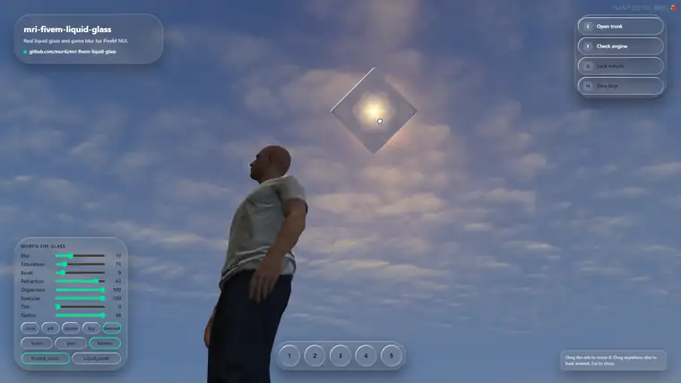

<div align="center">

# mri-fivem-liquid-glass

**Real liquid glass and game blur for FiveM NUI.**

CSS `backdrop-filter` cannot see the game inside the FiveM browser. This library can:
it blurs and refracts the live GTA V frame behind your HTML elements.

[](https://www.npmjs.com/package/mri-fivem-liquid-glass)
[](https://github.com/mur4i/mri-fivem-liquid-glass/actions/workflows/ci.yml)
[](LICENSE)
[](https://github.com/sponsors/mur4i)

**[Documentation](https://mur4i.github.io/mri-fivem-liquid-glass/guide/) · [Playground](https://mur4i.github.io/mri-fivem-liquid-glass/playground) · [Video](https://www.youtube.com/watch?v=W2z3DP6N95c) · [Presets](https://mur4i.github.io/mri-fivem-liquid-glass/presets) · [Showcase](https://mur4i.github.io/mri-fivem-liquid-glass/showcase) · [JSON API](https://mur4i.github.io/mri-fivem-liquid-glass/api) · [Português](README.pt-BR.md)**



</div>

## Why

Glass UIs look great in a normal browser and turn into flat, solid boxes in FiveM: the game is
not part of the page, it is composited underneath afterwards, so `backdrop-filter` has nothing
to blur. This library brings the live game frame into the page and draws the glass for you,
ready for production screens.

- **Frosted glass**: the game blurred behind any element, following its `border-radius`.
- **Liquid glass**: a bevelled rim that bends the sharp game image, with color split and a
  specular highlight.
- **Readable text**: each element gets `data-glass-backdrop="bright|dark"` so you can flip the
  text color over bright scenes.
- **Built for the game**: survives loading screens, black frames and lost hooks; never stalls
  the GPU to read pixels.
- **Tiny, no framework needed**: one module with zero dependencies (about 18 KB minified) for React,
  Vue, Svelte or plain HTML.

## Install

```bash
npm i mri-fivem-liquid-glass
```

No bundler? Load the single-file build, which exposes `window.MriLiquidGlass`:

```html
<script src="https://cdn.jsdelivr.net/npm/mri-fivem-liquid-glass/dist/mri-liquid-glass.iife.min.js"></script>
```

## Quick start

1. Start it once when your NUI boots:

   ```ts
   import { startGameGlass } from 'mri-fivem-liquid-glass'

   startGameGlass()
   ```

2. Mark your surfaces:

   ```html
   <div class="panel" data-glass>Frosted panel</div>
   <button class="pill" data-glass="liquid">Liquid button</button>
   ```

3. Keep the page transparent and the UI above the glass canvas:

   ```css
   html, body, #root { background: transparent; }
   #root { position: relative; z-index: 1; }

   [data-glass] {
     background: rgba(255, 255, 255, 0.06);  /* tint on top of the blur, keep it low */
     border: 1px solid rgba(255, 255, 255, 0.22);
     box-shadow: inset 0 1px 0 rgba(255, 255, 255, 0.3), 0 16px 36px rgba(0, 0, 0, 0.3);
   }
   [data-glass-backdrop="bright"] { color: #111; }
   ```

   Do **not** use `backdrop-filter` on these elements.

A minimal resource (fxmanifest, Lua and HTML) lives in
[examples/vanilla-resource](examples/vanilla-resource) (`/glassdemo`), and the full in game
showcase in [examples/showcase-resource](examples/showcase-resource) (`/liquidglass`).

### React

```tsx
import { useEffect } from 'react'
import { startGameGlass } from 'mri-fivem-liquid-glass'

export function App() {
  useEffect(() => {
    const glass = startGameGlass({ fallbackImage: import.meta.env.DEV ? '/dev-bg.jpg' : null })
    return () => glass.stop()
  }, [])
  return <div className="panel" data-glass="liquid">Hello</div>
}
```

## Markup

| Attribute | Values | Effect |
| --- | --- | --- |
| `data-glass` | (empty) | Frosted glass |
| `data-glass="liquid"` | | Bevelled rim, refraction, color split, highlight |
| `data-glass-bezel` | px | Width of the bevelled rim |
| `data-glass-refraction` | px | How far the rim bends the backdrop |
| `data-glass-dispersion` | 0 to 1 | Color split on the rim |
| `data-glass-specular` | 0 to 1 | Rim highlight strength |
| `data-glass-shape` | `diamond` | Diamond outline instead of the rounded box (`border-radius` rounds its tips) |
| `data-glass-lens` | `gem` / `kaleidoscope` | Faceted cut gem, or the backdrop mirrored into slices around the center |
| `data-glass-facets` | number | Facets of the gem (8) or slices of the kaleidoscope (6) |
| `data-glass-backdrop` | `bright` / `dark` | Set by the library from the backdrop luminance |

Any of the fine tuning attributes (or a lens) also turns the rim on for a plain `data-glass` element.

A diamond gem: `<div data-glass="liquid" data-glass-shape="diamond" data-glass-lens="gem"></div>`.
Give the element a matching `clip-path` so its own tint and border follow the diamond.

## Options

`startGameGlass(options)` returns `{ refresh, stop }`.

| Option | Default | Meaning |
| --- | --- | --- |
| `selector` | `'[data-glass]'` | Which elements get glass |
| `scale` | `0.25` | Blur buffer size relative to the screen |
| `blur` | `14` | Gaussian sigma in screen pixels |
| `saturation` | `1.15` | Backdrop saturation |
| `darken` | `1` | Backdrop brightness multiplier |
| `temporal` | `0.45` | Weight of each new frame at 60 fps, scaled by the real frame time (1 disables smoothing) |
| `light` | `[-0.6, -0.8]` | Highlight direction in screen space (top left) |
| `zIndex` | `0` | z-index of the glass canvas |
| `toneInterval` | `200` | ms between `data-glass-backdrop` updates |
| `fallbackImage` | `null` | Image used instead of the game outside FiveM |

`refresh()` re-reads radius, clipping and attributes after you change them through inline
`style`. Class and `data-glass*` changes are picked up automatically.

## Developing outside the game

In a normal browser there is no game frame, so the library stays off unless you pass
`fallbackImage` (a URL, an `` or a `<canvas>`). Use a screenshot of your scene to design
with the real look.

## Limits

- The glass canvas sits **under the whole UI**, so glass only shows the game. Glass over
  another opaque NUI panel does not blur that panel; glass over glass works.
- Elements may be scaled and translated; rotated elements are clipped to their bounding box.
- Corner radius comes from `border-top-left-radius`. Clipping follows the nearest ancestor with
  `overflow`.
- The canvas redraws every frame while glass is visible. Remove glass elements from the DOM when
  the screen closes and the loop stops by itself.
- DUI pages (`?mode=dui`) are skipped.

## FAQ

**Why not WebGPU?** The FiveM browser is Chromium 103. WebGPU shipped in Chrome 113, and the game
frame hook is a GL texture anyway.

**RedM?** The hook lives in the shared Cfx.re NUI layer, so it should work. Reports welcome.

**Performance?** `resmon` shows 0.00 ms for the showcase resource: nothing runs in Lua, the work is
on the GPU inside the NUI. On an RTX 4060 Laptop at 1080p there is no measurable FPS drop: closed, the
scene swings between 89 and 98 fps, and with all 21 glass elements on screen it stays around 90. Blur runs at a quarter of the screen and the rim math only inside glass
elements. Share your numbers in an issue.

## For AI agents

Using this library from an AI coding agent? One command teaches it the whole library:

```bash
npx mri-fivem-liquid-glass setup-ai   # Claude Code, Codex (AGENTS.md), Cursor, Copilot
```

See the [interactive onboarding](https://mur4i.github.io/mri-fivem-liquid-glass/guide/ai). The package also ships a ready skill at
`skills/mri-fivem-liquid-glass/SKILL.md`, the site serves [`llms.txt`](https://mur4i.github.io/mri-fivem-liquid-glass/llms.txt) and a
[JSON API](https://mur4i.github.io/mri-fivem-liquid-glass/api), and [AGENTS.md](AGENTS.md) explains how to build and test.

**If your agent improves the library while using it, please send the change back as a pull
request** instead of keeping a private patch. Docs, examples, presets and showcase entries merge
automatically when CI passes.

## Credits

Thank you to **Kypos** ([gtasnail](https://github.com/gtasnail)) for [fivem-glsl](https://github.com/gtasnail/fivem-glsl),
the first public proof of concept of running shaders on the game frame inside NUI
([forum post, 2024](https://forum.cfx.re/t/fivem-nui-glsl-poc-dev-resource/5261494)). It showed the
community that this was possible.

The game frame hook is part of the Cfx.re NUI layer and is used by
[screenshot-basic](https://github.com/citizenfx/screenshot-basic) and
[screencapture](https://github.com/itschip/screencapture). This library is written from
scratch on top of it.

Made by [Murai](https://github.com/mur4i) from the **MRI Brasil** team ([FiveM and Qbox projects](https://github.com/mri-Qbox-Brasil)),
where it already runs in production in interaction, garage and ox_lib screens.

Not affiliated with Apple, Cfx.re or Rockstar Games. "Liquid glass" describes the visual style.

## Contributing and support

Issues and pull requests are welcome: read [CONTRIBUTING.md](CONTRIBUTING.md). The quickest ways
to help: add your project to the [Showcase](https://mur4i.github.io/mri-fivem-liquid-glass/showcase), share a [preset](https://mur4i.github.io/mri-fivem-liquid-glass/presets), or
post your FPS numbers in an issue. If this saves you time, consider
[sponsoring](https://github.com/sponsors/mur4i).

## License

[MIT](LICENSE)
