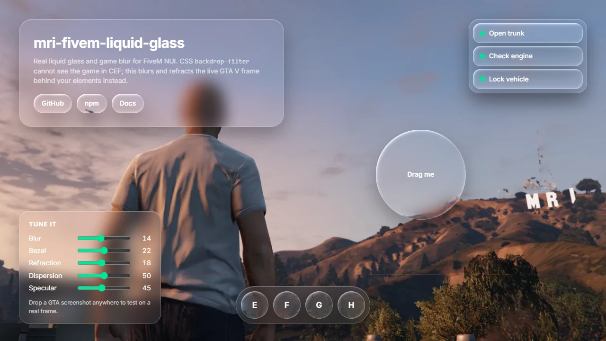

<div align="center">

# mri-fivem-liquid-glass

**Liquid glass e blur do jogo de verdade na NUI do FiveM.**

O `backdrop-filter` do CSS não enxerga o jogo dentro do navegador do FiveM. Esta biblioteca
enxerga: ela desfoca e refrata o frame do GTA V, ao vivo, atrás dos seus elementos HTML.

[Demo ao vivo](https://mur4i.github.io/mri-fivem-liquid-glass/) ·
[Como funciona](docs/how-it-works.md) ·
[English](README.md)



</div>

## Por quê

Interface de vidro fica linda no navegador comum e vira caixa lisa e opaca no FiveM: o jogo não
faz parte da página, ele é composto por baixo depois, então o `backdrop-filter` não tem o que
desfocar. Resources pagos contornam isso com código fechado. Esta é a versão aberta e
documentada.

- **Vidro fosco**: o jogo desfocado atrás de qualquer elemento, seguindo o `border-radius`.
- **Liquid glass**: borda em bisel que entorta a imagem nítida do jogo, com separação de cor e
  brilho especular.
- **Texto legível**: cada elemento ganha `data-glass-backdrop="bright|dark"` pra você trocar a
  cor do texto sobre cena clara.
- **Feito pro jogo**: aguenta tela de loading, frame preto e hook perdido, sem travar a GPU pra
  ler pixel.
- **Pequena e sem framework**: um módulo sem dependências (uns 16 KB minificado) pra React, Vue,
  Svelte ou HTML puro.

## Instalar

```bash
npm i mri-fivem-liquid-glass
```

Sem bundler? Carregue o arquivo único, que expõe `window.MriLiquidGlass`:

```html
<script src="https://cdn.jsdelivr.net/npm/mri-fivem-liquid-glass/dist/mri-liquid-glass.iife.min.js"></script>
```

## Começo rápido

1. Inicie uma vez quando a NUI sobe:

   ```ts
   import { startGameGlass } from 'mri-fivem-liquid-glass'

   startGameGlass()
   ```

2. Marque as superfícies:

   ```html
   <div class="panel" data-glass>Painel fosco</div>
   <button class="pill" data-glass="liquid">Botão liquid</button>
   ```

3. Página transparente e a UI acima do canvas do vidro:

   ```css
   html, body, #root { background: transparent; }
   #root { position: relative; z-index: 1; }

   [data-glass] {
     background: rgba(255, 255, 255, 0.06);  /* tinta por cima do blur, mantenha baixa */
     border: 1px solid rgba(255, 255, 255, 0.22);
     box-shadow: inset 0 1px 0 rgba(255, 255, 255, 0.3), 0 16px 36px rgba(0, 0, 0, 0.3);
   }
   [data-glass-backdrop="bright"] { color: #111; }
   ```

   **Não** use `backdrop-filter` nesses elementos.

Um resource completo (fxmanifest, Lua e HTML) está em
[examples/vanilla-resource](examples/vanilla-resource). No jogo, digite `/glassdemo`.

### React

```tsx
import { useEffect } from 'react'
import { startGameGlass } from 'mri-fivem-liquid-glass'

export function App() {
  useEffect(() => {
    const glass = startGameGlass({ fallbackImage: import.meta.env.DEV ? '/dev-bg.jpg' : null })
    return () => glass.stop()
  }, [])
  return <div className="panel" data-glass="liquid">Olá</div>
}
```

## Marcação

| Atributo | Valores | Efeito |
| --- | --- | --- |
| `data-glass` | (vazio) | Vidro fosco |
| `data-glass="liquid"` | | Borda em bisel, refração, separação de cor, brilho |
| `data-glass-bezel` | px | Largura do bisel |
| `data-glass-refraction` | px | Quanto a borda entorta o fundo |
| `data-glass-dispersion` | 0 a 1 | Separação de cor na borda |
| `data-glass-specular` | 0 a 1 | Força do brilho da borda |
| `data-glass-shape` | `diamond` | Contorno de diamante no lugar do retângulo arredondado (o `border-radius` arredonda as pontas) |
| `data-glass-lens` | `gem` / `kaleidoscope` | Gema lapidada em facetas, ou o fundo espelhado em fatias em volta do centro |
| `data-glass-facets` | número | Facetas da gema (8) ou fatias do caleidoscópio (6) |
| `data-glass-backdrop` | `bright` / `dark` | Definido pela biblioteca pelo brilho do fundo |

Qualquer atributo de ajuste fino (ou uma lente) também liga o bisel num `data-glass` comum.

Um diamante lapidado: `<div data-glass="liquid" data-glass-shape="diamond" data-glass-lens="gem"></div>`.
Dê ao elemento um `clip-path` igual, pra a tinta e a borda dele seguirem o diamante.

## Opções

`startGameGlass(options)` retorna `{ refresh, stop }`.

| Opção | Padrão | Significado |
| --- | --- | --- |
| `selector` | `'[data-glass]'` | Quais elementos ganham vidro |
| `scale` | `0.25` | Tamanho do buffer do blur em relação à tela |
| `blur` | `14` | Sigma do gaussiano em px de tela |
| `saturation` | `1.15` | Saturação do fundo |
| `darken` | `1` | Multiplicador de brilho do fundo |
| `temporal` | `0.45` | Peso de cada frame novo a 60 fps, ajustado pelo tempo real do frame (1 desliga a suavização) |
| `light` | `[-0.6, -0.8]` | Direção do brilho em coordenadas de tela (de cima à esquerda) |
| `zIndex` | `0` | z-index do canvas do vidro |
| `toneInterval` | `200` | ms entre atualizações do `data-glass-backdrop` |
| `fallbackImage` | `null` | Imagem usada no lugar do jogo fora do FiveM |

`refresh()` relê raio, corte e atributos depois de mudar algo por `style` inline. Mudança de
classe e de `data-glass*` é detectada sozinha.

## Desenvolvendo fora do jogo

No navegador comum não existe frame do jogo, então a biblioteca fica desligada, a não ser que
você passe `fallbackImage` (URL, `` ou `<canvas>`). Use um print da sua cena pra desenhar já
com o visual real.

## Limites

- O canvas do vidro fica **embaixo de toda a UI**: o vidro mostra só o jogo. Vidro sobre outro
  painel opaco da NUI não desfoca o painel; vidro sobre vidro funciona.
- Elemento pode ter escala e translação; elemento girado é recortado pelo retângulo dele.
- O raio vem do `border-top-left-radius`. O corte segue o primeiro pai com `overflow`.
- O canvas redesenha a cada frame enquanto há vidro visível. Tire os elementos do DOM quando a
  tela fechar e o loop para sozinho.
- Páginas DUI (`?mode=dui`) são ignoradas.

## Perguntas

**Por que não WebGPU?** O navegador do FiveM é Chromium 103. WebGPU só saiu no Chrome 113, e o
hook do frame do jogo é uma textura GL de qualquer jeito.

**RedM?** O hook fica na camada de NUI comum da Cfx.re, então deve funcionar. Relatos são
bem-vindos.

**Desempenho?** O blur roda em 1/4 da tela e a conta do bisel só roda dentro dos elementos de
vidro. Meça com o `resmon` e o contador de FPS, e abra uma issue com seus números.

## Créditos

O hook do frame do jogo faz parte da camada de NUI da Cfx.re e é usado pelo
[screenshot-basic](https://github.com/citizenfx/screenshot-basic) e pelo
[screencapture](https://github.com/itschip/screencapture). Esta biblioteca foi escrita do zero
em cima dele.

Feito por [Murai](https://github.com/mur4i), da equipe [MRI Qbox Brasil](https://github.com/mri-Qbox-Brasil),
onde já roda em produção nas telas de interação, garagem e ox_lib.

Sem vínculo com Apple, Cfx.re ou Rockstar Games. "Liquid glass" descreve o estilo visual.

## Contribuir e apoiar

Issues e pull requests são bem-vindos: leia o [CONTRIBUTING.md](CONTRIBUTING.md). Se isto te
poupou tempo, considere [apoiar](https://github.com/sponsors/mur4i).

## Licença

[MIT](LICENSE)
